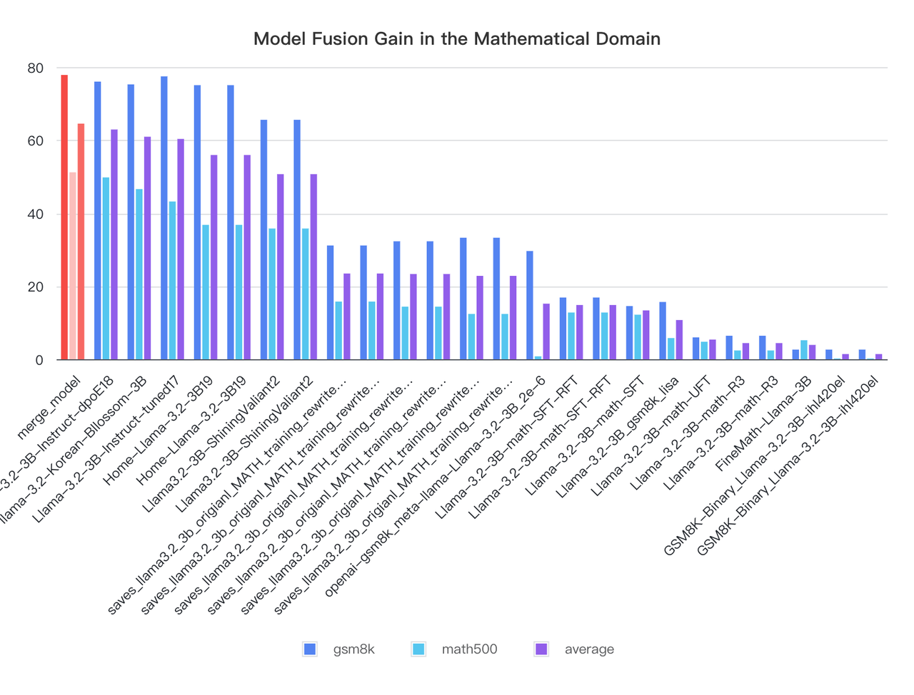

# Model Merge Toolkit

一个基于 **Task Arithmetic** 的深度学习模型合并工具集，用于分析和合并多个微调模型的能力。

## 📋 项目简介

本项目提供了两个核心工具：

1. **任务向量分析工具** (`TA_analyzer.py`) - 分析微调模型与基础模型之间的差异
2. **自适应模型合并工具** (`TA_adaptive_merge.py`) - 基于 L2 范数智能合并多个模型

### 核心特性

- ✅ **智能权重计算**：根据 L2 范数自动计算最优融合权重
- ✅ **内存高效**：流式处理，支持大模型分析合并
- ✅ **GPU 加速**：支持单 GPU 和多 GPU 并行计算
- ✅ **详细统计**：提供参数级别和模块级别的详细分析

---

## 🚀 快速开始

### 安装依赖

```bash
pip install -r requirements.txt
```

### 完整工作流

典型的模型合并流程分为两步：

1. **步骤 1：分析模型** - 使用 `TA_analyzer.py` 计算各模型的 L2 范数
2. **步骤 2：合并模型** - 使用 `TA_adaptive_merge.py` 基于 L2 范数智能合并

---

## 📚 工具文档

### 1. 任务向量分析工具

**脚本位置**：`model_filter/TA_analyzer.py`  
**详细文档**：请查看 [`model_filter/TA_analyzer.md`](model_filter/TA_analyzer.md)

**功能**：
- 计算任务向量：Δ = target_model - base_model
- 提供参数级别的详细统计（L2/L1范数、分位数、偏度、峰度等）
- 生成模块级别的聚合分析
- 计算多个模型之间的成对余弦相似度

### 2. 自适应模型合并工具

**脚本位置**：`model_merge/TA_adaptive_merge.py`  
**详细文档**：请查看 [`model_merge/TA_adaptive_merge.md`](model_merge/TA_adaptive_merge.md)

**功能**：
- 基于 Task Arithmetic 算法合并多个模型
- 根据 L2 范数自动计算融合权重（支持 linear、power、exp 三种模式）
- 流式处理，内存高效

---

## 💡 使用示例

### 示例：分析并合并 5 个 Llama-3.2-3B 微调模型

#### 步骤 1：分析模型任务向量

**命令**：

```bash
python model_filter/TA_analyzer.py \
  --base /path/to/meta-llama/Llama-3.2-3B-Instruct/ \
  --models \
    /path/to/Llama-3.2-3B_MATH_lisa \
    /path/to/llama-3.2-Korean-Bllossom-3B \
    /path/to/Llama-3.2-3B-Instruct-tuned \
    /path/to/EZO-Llama-3.2-3B-Instruct-dpoE \
    /path/to/Home-Llama-3.2-3B \
  --outdir ./tv_analysis \
  --device cuda \
  --multi-gpu
```

**输出结果**：

```
[*] Multi-GPU mode: Using 8 GPUs in parallel
[GPU 0] Computing stats for Llama-3.2-3B_MATH_lisa...
[GPU 1] Computing stats for llama-3.2-Korean-Bllossom-3B...
[GPU 2] Computing stats for Llama-3.2-3B-Instruct-tuned...
[GPU 3] Computing stats for EZO-Llama-3.2-3B-Instruct-dpoE...
[GPU 4] Computing stats for Home-Llama-3.2-3B...

[+] Completed Llama-3.2-3B_MATH_lisa: 
    {'global_l2': 182.63449803905507, 'global_l1': 8521257.21, ...}

[+] Completed llama-3.2-Korean-Bllossom-3B: 
    {'global_l2': 31.87331429925808, 'global_l1': 409032.54, ...}

[+] Completed Llama-3.2-3B-Instruct-tuned: 
    {'global_l2': 0.0, 'global_l1': 0.0, ...}

[+] Completed EZO-Llama-3.2-3B-Instruct-dpoE: 
    {'global_l2': 0.5286774117008595, 'global_l1': 10381.85, ...}

[+] Completed Home-Llama-3.2-3B: 
    {'global_l2': 9.263518169578077, 'global_l1': 117752.22, ...}

wrote results to ./tv_analysis
```

**关键输出文件**：
- `./tv_analysis/<model_name>/summary.json` - 包含 `global_l2` 值（用于合并）

#### 步骤 2：提取 L2 范数值

从 `summary.json` 文件中提取各模型的 `global_l2` 值：

```bash
# 方法1：手动查看 summary.json
cat ./tv_analysis/Llama-3.2-3B_MATH_lisa/summary.json | grep global_l2

# 方法2：使用 Python 提取
python -c "import json; print(json.load(open('./tv_analysis/Llama-3.2-3B_MATH_lisa/summary.json'))['global_l2'])"
```

**提取的 L2 值**：
- Llama-3.2-3B_MATH_lisa: `182.6345`
- llama-3.2-Korean-Bllossom-3B: `31.8733`
- Llama-3.2-3B-Instruct-tuned: `0.0000`
- EZO-Llama-3.2-3B-Instruct-dpoE: `0.5287`
- Home-Llama-3.2-3B: `9.2635`

#### 步骤 3：智能合并模型

**命令**：

```bash
python model_merge/TA_adaptive_merge.py \
  --base_model_path /path/to/meta-llama/Llama-3.2-3B-Instruct/ \
  --other_model_paths \
    /path/to/Llama-3.2-3B_MATH_lisa \
    /path/to/llama-3.2-Korean-Bllossom-3B \
    /path/to/Llama-3.2-3B-Instruct-tuned \
    /path/to/EZO-Llama-3.2-3B-Instruct-dpoE \
    /path/to/Home-Llama-3.2-3B \
  --l2_norms \
    182.63449804 \
    31.87331430 \
    0.00000000 \
    0.52867741 \
    9.26351817 \
  --output_path ./merged_model_output \
  --mode exp \
  --device cuda
```

**输出结果**：

```
=== 自动计算的 λ 系数 ===
Llama-3.2-3B_MATH_lisa          L2=182.6345  λ=0.005153
llama-3.2-Korean-Bllossom-3B    L2=31.8733   λ=0.148450
Llama-3.2-3B-Instruct-tuned     L2=0.0000    λ=0.302100
EZO-Llama-3.2-3B-Instruct-dpoE  L2=0.5287    λ=0.298560
Home-Llama-3.2-3B               L2=9.2635    λ=0.245736

[*] 使用设备: cuda
[*] Base 模型: /path/to/meta-llama/Llama-3.2-3B-Instruct/
[*] 待融合[0]: path=.../Llama-3.2-3B_MATH_lisa, λ=0.00515
[*] 待融合[1]: path=.../llama-3.2-Korean-Bllossom-3B, λ=0.14845
[*] 待融合[2]: path=.../Llama-3.2-3B-Instruct-tuned, λ=0.30210
[*] 待融合[3]: path=.../EZO-Llama-3.2-3B-Instruct-dpoE, λ=0.29856
[*] 待融合[4]: path=.../Home-Llama-3.2-3B, λ=0.24574

[*] 正在加载 Base 模型到 cuda: ...
[*] 正在加载 Base 模型到 CPU 以计算 task vector: ...

[***] 开始融合模型 1/5: Llama-3.2-3B_MATH_lisa
      λ = 0.005153
融合 Llama-3.2-3B_MATH_lisa: 100%|██████████| 255/255 [00:06<00:00, 37.67it/s]
      完成模型 Llama-3.2-3B_MATH_lisa 的融合。释放内存...

[***] 开始融合模型 2/5: llama-3.2-Korean-Bllossom-3B
      λ = 0.148450
融合 llama-3.2-Korean-Bllossom-3B: 100%|██████████| 255/255 [00:05<00:00, 49.38it/s]
      完成模型 llama-3.2-Korean-Bllossom-3B 的融合。释放内存...

[***] 开始融合模型 3/5: Llama-3.2-3B-Instruct-tuned
      λ = 0.302100
融合 Llama-3.2-3B-Instruct-tuned: 100%|██████████| 255/255 [00:05<00:00, 49.20it/s]
      完成模型 Llama-3.2-3B-Instruct-tuned 的融合。释放内存...

[***] 开始融合模型 4/5: EZO-Llama-3.2-3B-Instruct-dpoE
      λ = 0.298560
融合 EZO-Llama-3.2-3B-Instruct-dpoE: 100%|██████████| 255/255 [00:05<00:00, 48.47it/s]
      完成模型 EZO-Llama-3.2-3B-Instruct-dpoE 的融合。释放内存...

[***] 开始融合模型 5/5: Home-Llama-3.2-3B
      λ = 0.245736
融合 Home-Llama-3.2-3B: 100%|██████████| 255/255 [00:05<00:00, 46.89it/s]
      完成模型 Home-Llama-3.2-3B 的融合。释放内存...

[*] 所有模型融合完成，正在保存结果 ...
[+] 成功！融合后的模型已保存到: ./merged_model_output
```

**权重分析**：
- **MATH_lisa (L2=182.63)**: λ=0.005，权重最小（防止数学偏向过强）
- **Korean-Bllossom (L2=31.87)**: λ=0.148，中等权重
- **Instruct-tuned (L2=0.00)**: λ=0.302，高权重（与base一致，安全）
- **DPO (L2=0.53)**: λ=0.299，高权重（轻微调整）
- **Home (L2=9.26)**: λ=0.246，较高权重（通用性好）

### 数学模型上的效果

以instruct模型为底座，融合了5个模型，这5个模型的norm和instruct模型最接近，最后融合得到的模型在数学能力上超越了所有候选模型。



---

## 📖 更多信息

### 查看详细文档

- **任务向量分析工具**：查看 [`model_filter/TA_analyzer.md`](model_filter/TA_analyzer.md)
  - 完整的命令行参数说明
  - 输出文件格式说明
  - 性能优化建议
  - 常见问题解答

- **模型合并工具**：查看 [`model_merge/TA_adaptive_merge.md`](model_merge/TA_adaptive_merge.md)
  - 权重计算模式详解（linear、power、exp）
  - 完整工作流示例
  - 自动化脚本示例

### 使用脚本简化操作

项目提供了 `model_merge/merge_commands.sh` 脚本，可以编辑其中的配置后直接运行：

```bash
# 编辑脚本配置模型路径和 L2 值
vim model_merge/merge_commands.sh

# 执行合并
bash model_merge/merge_commands.sh
```

---

## 🔧 依赖要求

- Python >= 3.8
- PyTorch >= 2.0.0
- transformers >= 4.30.0
- 其他依赖见 `requirements.txt`

---

## 📝 许可证

本项目采用 [MIT License](LICENSE) 许可证。

Copyright (c) 2025 model-merge-tookit contributors

---

## 🤝 贡献

欢迎提交 Issue 和 Pull Request！
